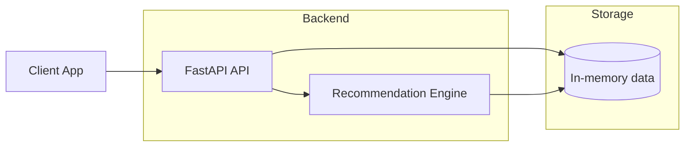

# 🛍️ Social Commerce Backend & Recommendation Engine

This project provides a minimal **social commerce backend** implemented with FastAPI. It supports user management, product catalog, order processing, and a simple rule‑based recommendation endpoint.

The goal is to demonstrate core API functionality in a lightweight, easy‑to‑run package.


```mermaid
flowchart LR
    Client[Client App]
    subgraph Backend
      API[FastAPI API]
      Rec[Recommendation Engine]
    end
    subgraph Storage
      DB[(In-memory data)]
    end
    Client --> API
    API --> DB
    API --> Rec
    Rec --> DB
```

---

## 🚀 Features

- Lightweight FastAPI backend with in-memory data store
- Endpoints for users, products, orders and recommendations
- Simple rule‑based recommendation logic
- Easy to run locally without external dependencies

---

## 🧱 Architecture Overview

The application consists of a single FastAPI service that maintains data in memory. A client interacts with the API over HTTP; recommendations are calculated on the fly.

---

## 📂 Folder Structure

```
├── README.md
├── requirements.txt
└── backend/
    └── app/
        └── main.py
```

---

## ⚙️ Setup Instructions

### 🧑‍💻 Prerequisites

- Python 3.9+

### 🔧 Local Setup

1. Clone the repo and enter it:

```bash
git clone https://github.com/juangedaan/e-commerce-backend.git
cd e-commerce-backend
```

2. Create and activate a virtual environment:

```bash
python -m venv venv
source venv/bin/activate
```

3. Install dependencies:

```bash
pip install -r requirements.txt
```

4. Start the application:

```bash
uvicorn backend.app.main:app --reload
```

5. The API docs will be available at [http://localhost:8000/docs](http://localhost:8000/docs)

---

## 🧠 ML Recommendation Engine

- Uses a simple **user-based collaborative filtering** approach
- Input: Simulated `user-product` interaction matrix
- Output: Product suggestions per user via `/recommendations/{user_id}` endpoint
- Engine trained with `scikit-learn`

---

## 🗂️ Dataset

This project uses a real-world e-commerce dataset to populate the product catalog and simulate user-product interactions:

- **Dataset Source:** [Amazon Products CSV - Luminati eCommerce Dataset Samples](https://github.com/luminati-io/eCommerce-dataset-samples/blob/main/amazon-products.csv)
- **Contents:** Thousands of product entries including name, category, price, rating, and other metadata fields.

Products will be imported into PostgreSQL during the database initialization phase.

---

## ✅ API Highlights

| Endpoint                      | Description                      |
|------------------------------|----------------------------------|
| `POST /users/`               | Create a user                    |
| `GET /products/`             | List all products                |
| `POST /orders/`              | Submit a purchase                |
| `GET /recommendations/{id}`  | Get product recommendations      |

---

## 🔐 Resilience & Performance

- **Rate limiting** with API throttles
- **Exponential backoff** on retry logic
- Query optimization for sub-second latency
- Horizontally scalable design across AWS regions

---

# 🚀 Quickstart Guide

## 📦 Setup Environment

```bash
pip install -r requirements.txt -r dev-requirements.txt
```

## 🏗️ Run Locally (Dev Mode)

```bash
cd backend
docker-compose up --build
```
The API will be available at [http://localhost:8000](http://localhost:8000).

## 🧪 Run Tests

```bash
make test
```
Or generate an HTML test report:

```bash
make test-html
```

## ☁️ Deploy to AWS

See [deployment/aws-deployment.md](deployment/aws-deployment.md) for detailed cloud deployment instructions.

---

## 📄 License

MIT License © Juan Moreno
